# Praktikum 8
## Kode program data nilai mahasiswa

### langkah 1
Class ini digunakn untuk menyimpan, menampilkan, mengubah, dan menghapus daftar nilai mahasiswa. bertanggung jawab dalam mengelola data mahasiswa.
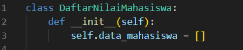

### Langkah 2
Method:
1. tambah(nama, nilai), digunakan untuk menambahkan data mahasiswa ke dalam daftar. input: nama (string) dan nilai (integer):
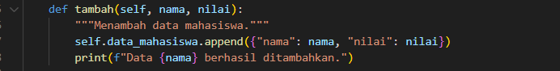

2. tampilkan(), Menampilkan seluruh daftar data mahasiswa di dalam. Jika list kosong, menampilkan  "Belum ada data mahasiswa.":
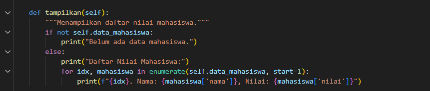

3. hapus(self, nama), berguna untuk menghapus data mahasiswa berdasarkan nama. jika nama ditemukan data akan dihapus dan jika tidak ada data menampilkan "data tidak ditemukan":
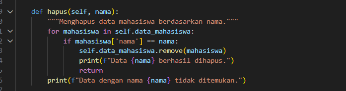

4. ubah(self, nama, nilai_baru), mengubah nilai mahasiswa berdasarkan nama. jika datanilai ada, nilai mahasiswa diganti dengan nilai baru. jika tidak ada menampilkan "data tidak ditemukan":
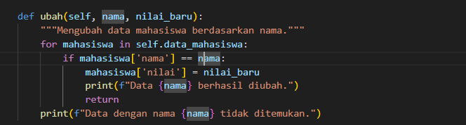

### Langkah 3
Program:  berguna menjalankan kode program:
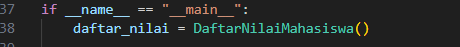

1. tambah data, menambahkan data dan nilai mahasiswa ke daftar.
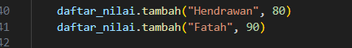

2. tampilkan data, berfungsi menampilkan data mahasiswa yang ditambhakan:
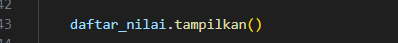

3. ubah data, berfungsi mengubah nilai mahasiswa:
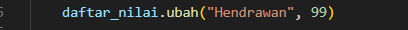

4. tampilkan data setelah perubahan, menampilkan data mahasiswa yang dirubah:

5. hapus data, menghapus data mahasiswa dari daftar:

6. menampilkan data yang telah dihapus
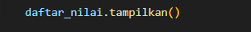

### Hasil eksekusi perogram
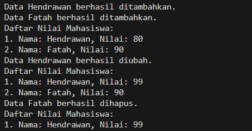

## Flowchart
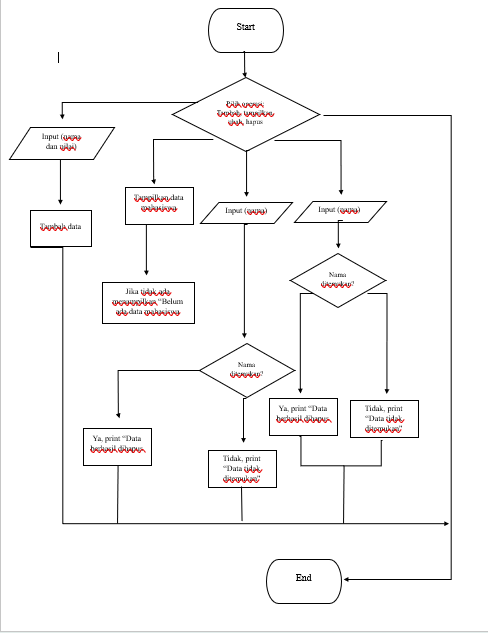