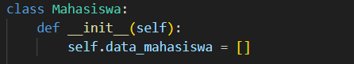
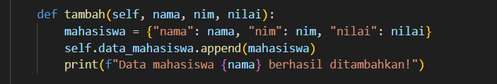
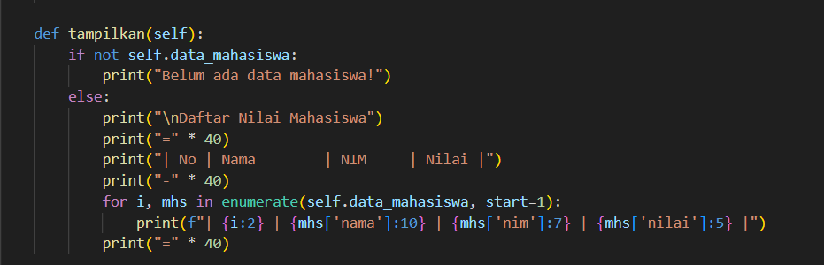
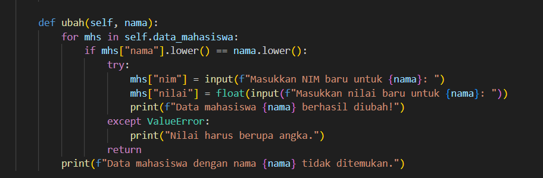
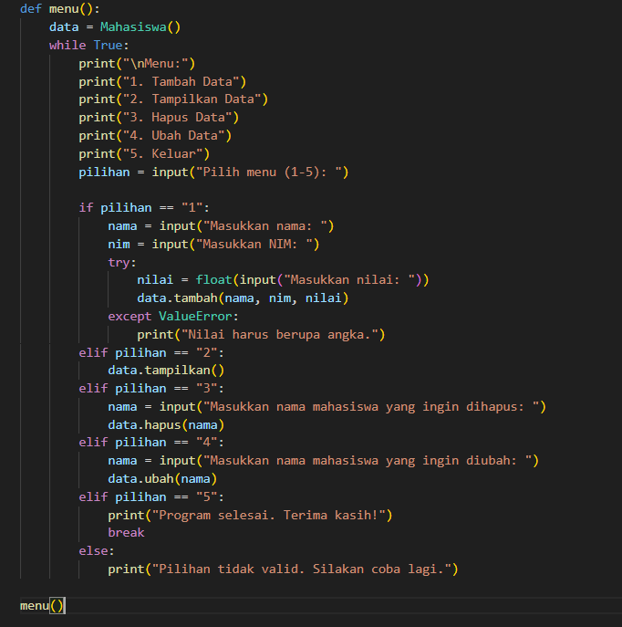
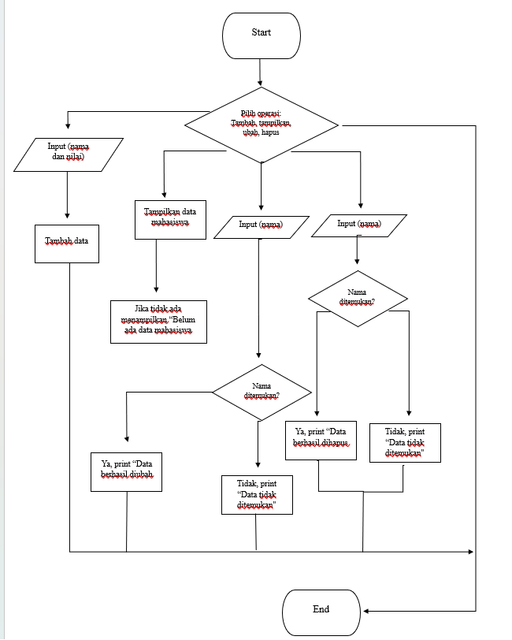

# praktikum 8## Kode program data nilai mahasiswa

### langkah 1
Class ini digunakn untuk menyimpan, menampilkan, mengubah, dan menghapus daftar nilai mahasiswa. bertanggung jawab dalam mengelola data mahasiswa.

### Langkah 2
Method:
1. tambah(nama, nilai), digunakan untuk menambahkan data mahasiswa ke dalam daftar. input: nama (string) dan nilai (integer):

2. tampilkan(), Menampilkan seluruh daftar data mahasiswa di dalam. Jika list kosong, menampilkan  "Belum ada data mahasiswa.":

3. hapus(self, nama), berguna untuk menghapus data mahasiswa berdasarkan nama. jika nama ditemukan data akan dihapus dan jika tidak ada data menampilkan "data tidak ditemukan":

4. ubah(self, nama, nilai_baru), mengubah nilai mahasiswa berdasarkan nama. jika datanilai ada, nilai mahasiswa diganti dengan nilai baru. jika tidak ada menampilkan "data tidak ditemukan":

### Langkah 3
Cetak daftar pilihan menu: Tambah, Tampilkan, Hapus, Ubah, Keluar.
Input pilihan pengguna. 
Jalankan fungsi sesuai pilihan:
1= Menambahkan data.
2= Menampilkan data.
3= Menghapus data.
4= Mengubah data.
5= Keluar dari program.
Jika pilihan tidak valid, tampilkan pesan kesalahan.

### Hasil eksekusi
opsi 1:
[Gambar 1](screenshot/pas8.png)

opsi 2:
[Gambar 1](screenshot/pas10.png)
jika tidak ada:
[Gambar 1](screenshot/pas9.png)

opsi 3:
[Gambar 1](screenshot/pas11.png)

opsi 4:
[Gambar 1](screenshot/pas12.png)

opsi 5:
[Gambar 1](screenshot/pas13.png)

## Diagram class
[Gambar 1](screenshot/pas7.png)

## Flowchart
### Langkah 1
Program dimulai:

### langkah 2
Pengguna diminta untuk memilih salah satu operasi: tambah, tampilkan, ubah, dan hapus.:

### Langkah 3
tambah(), masukkan data berdassarkan nama dan nilai, lalu disimpan kedalam sistem:

### Langkah 4
tampilkan(), pengguna meminnta program untuk menampilkan data yang disimpan. jika ada menampilkan semua data, jika tidak menampilkan pesan "Belum ada data mahasiswa":

### Langkah 5
ubah(), input nama yanag akan diubah. periksa data berdasarkan nama. jika ada menampilkan "data berhasil diubah", jika tidak menammpilkan "Data tidak ditemukan":

### Langkah 6
hapus(), pengguna memasukan nama yang ingin dihapus. Jika ditemukan, data dihapus, dan tampilkan pesan: "Data berhasil dihapus", Jika tidak ditemukan, tampilkan pesan: "Data tidak ditemukan". :

### LAngkah 7
Program selesai

